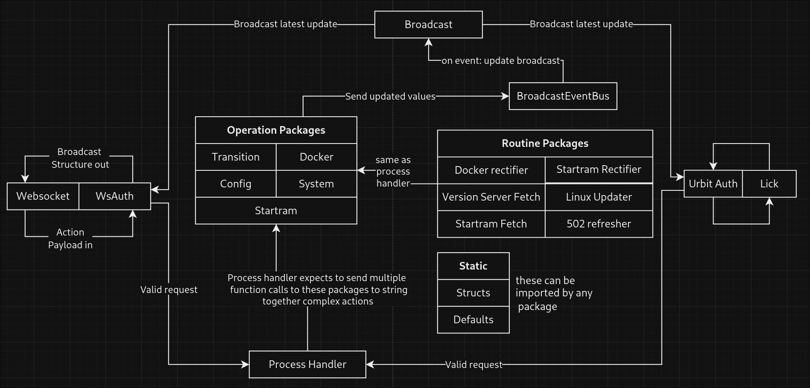

# Goseg

### A guide to goseg packages

## Main
- Goroutines and packages get initialized here

## Mainline packages
- Control the flow of data in and out via the standard json structure

### Websocket and Websocket auth (API)
- Imports Handler
- Can be separate packages or just one. Doesn't really matter.
- Receives ws requests, run it through auth.
- Check if it is a valid payload.
- If invalid, sends nack.
- If valid, sends ack and pass request to Handler.

### Urbit Auth and Lick
- Import Handler
- Receives lick %spits
- Puts it through auth
- Pass valid requests to Handler

### Process Handler (Handler)
- Imports Operation Packages
- Receives valid requests only
- String operation calls together 

### BroadcastEventBus
- Imports..NOTHING!
- A channel

### Broadcast
- Imports BroadcastEventBus and the APIs
- Listens to BroadcastEventBus and sends a broadcast out to the APIs

## Routine Packages
- Rectifiers, fetch loops, and correction loops
- Imports Operation Packages

## Operation Packages
- Receives operation calls from routines or process handler
- Sends broadcast calls to BroadcastEventBus
- Cannot import anything but helper libraries
- Goal is to have a number of versatile and simple function calls

### Docker
- Stateless
- Read and write to Docker Socket
- Modify the filesystem (should this be in System instead?)

### Config
- Maintains state
- Read and write to BasePath/settings/

### StarTram
- Maintains state
- Wrapper for api.startram.io calls

### System
- Stateless
- Read and write system related functions (RAM/CPU etc)

### Transition
- Maintains state
- Sends transitions to BroadcastEvenBus
