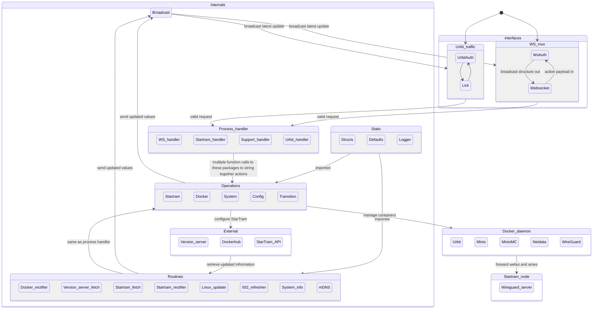

## GroundSeg API Golang rewrite (`goseg`)

```mermaid
stateDiagram-v2
    direction TB
    accTitle: Goseg package diagram
    accDescr: Interactions between packages in Groundseg Go rewrite
    classDef bcase fill:#f00,color:white,font-weight:bold,stroke-width:2px,stroke:yellow
    Broadcast-->WS_mux: broadcast latest update
    Broadcast-->Urbit_traffic: broadcast latest update
    Static-->Operations: imported
    Static-->Routines: imported
    state Startram_node {
        Wireguard_server
    }
    state Internals {
        state Static {
            Structs
            Defaults
            Logger
        }
        state Routines {
            Docker_rectifier
            Version_server_fetch
            Startram_fetch
            Startram_rectifier
            Linux_updater
            502_refresher
            System_info
            mDNS
        }
        state Operations {
            Startram
            Docker
            System
            Config
            Transition
        }
        state Process_handler {
            WS_handler
            Startram_handler
            Support_handler
            Urbit_handler
        }
        Process_handler-->Operations: multiple function calls to these packages to string together actions
        Operations-->Broadcast: send updated values
        Routines-->Broadcast: send updated values
        External-->Routines: retrieve updated information
        Operations-->External: configure StarTram
    }
    [*]-->WS_mux
    [*]-->Urbit_traffic
    WS_mux-->Process_handler: valid request
    Urbit_traffic-->Process_handler: valid request
    Routines-->Operations: same as process handler
    state interfaces {
        state Urbit_traffic {
            UrbitAuth-->Lick
            Lick-->UrbitAuth
        }
        state WS_mux {
            WsAuth-->Websocket: broadcast structure out
            Websocket-->WsAuth: action payload in
        }
    }
    state Docker_daemon {
        Urbit
        Minio
        MinioMC
        Netdata
        WireGuard
    }
    state External {
        Version_server
        Dockerhub
        StarTram_API
    }
    Operations-->Docker_daemon: manage containers
    Docker_daemon-->Startram_node: forward webui and ames
```