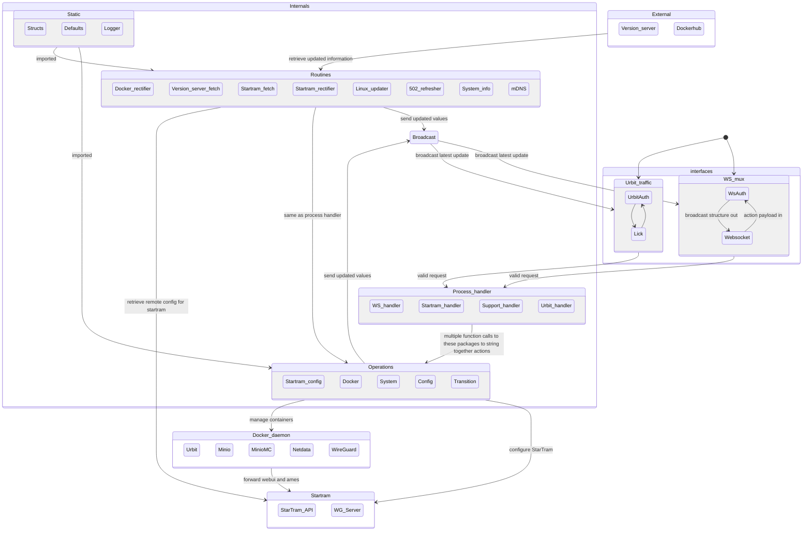

## GroundSeg API Golang rewrite (`goseg`)

## Local Verification

Run before opening backend/runtime PRs:

1. `go test ./...`
2. `go test -tags=integration ./broadcast ./handler ./routines ./ws` (requires Docker and runtime dependencies)

## Websocket Action Contract (v1.0)

The shared websocket action registry now lives in `protocol/actions` and should be treated as the
single source of truth for command tokens that originate from the client:

- `c2c` domain (`goseg/system/wifi_*`)
- supported action: `connect` (`groundseg/protocol/actions.ActionC2CConnect`)
- `upload` domain (`goseg/uploadsvc`)
  - supported actions: `open-endpoint`, `reset`

Each domain keeps parse/dispatch parity by consuming:

- shared constants from `groundseg/protocol/actions`
- domain-specific parser wrappers (`ParseC2CAction`, `ParseAction`)
- shared unsupported action error semantics (`UnsupportedActionError`)

Compatibility guidance:

- Additions or removals to action surfaces require updates in `protocol/actions`
  and the domain parser/executor tests.
- Unknown actions must always return the shared unsupported action error contract.

When changing API boundaries, prefer explicit fetch vs sync naming (for example `Fetch*` read-only and `Sync*` mutating/persisting).
